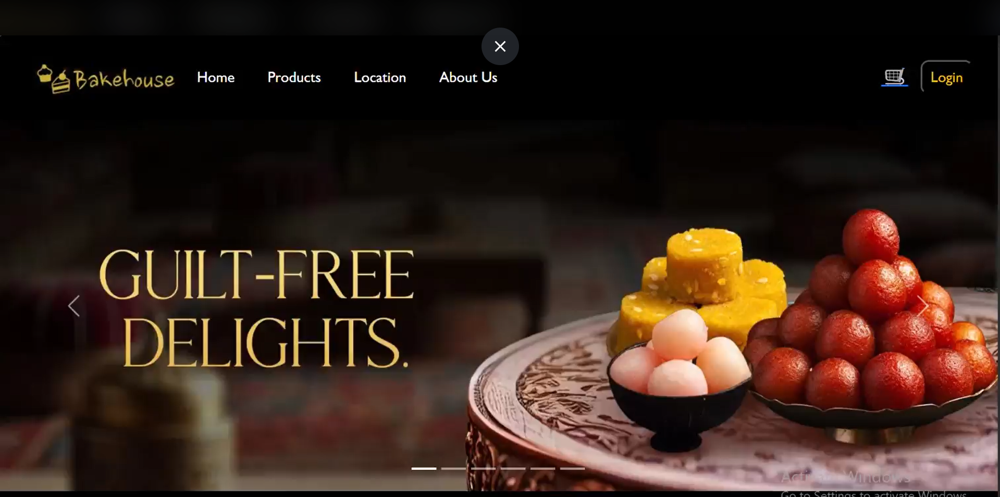
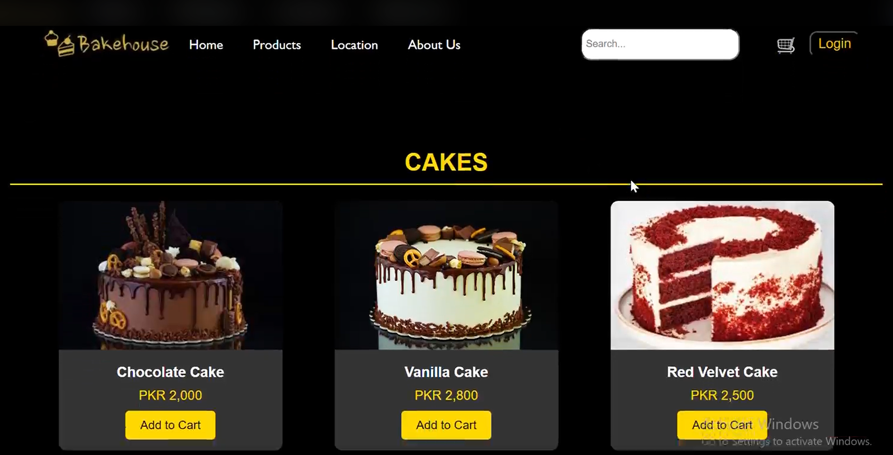
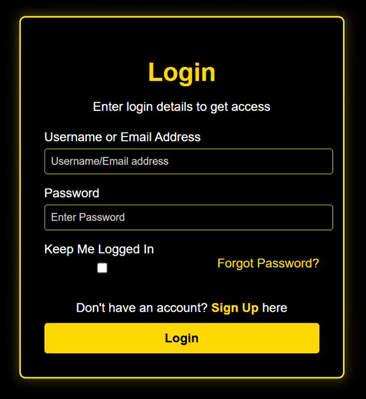
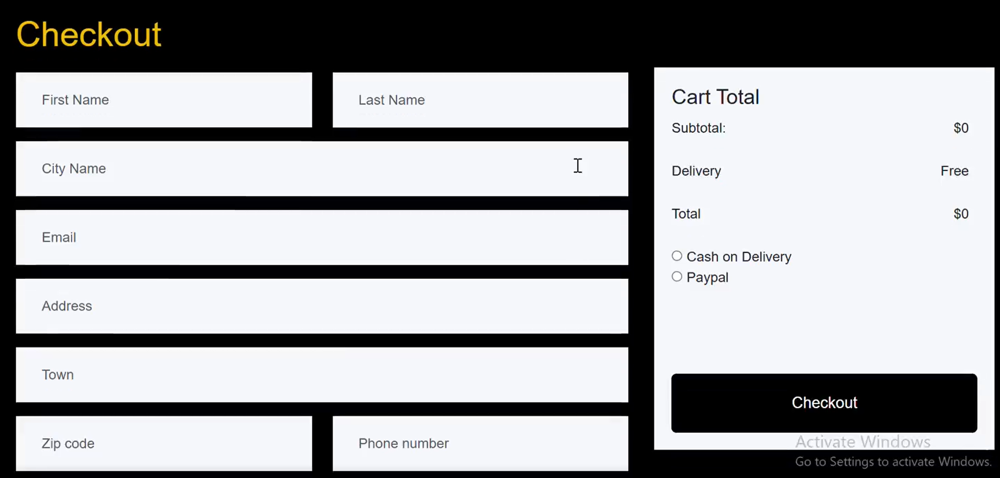

# 🥐 Bake House – Full-Scale Bakery E-Commerce Frontend

[](https://opensource.org/licenses/MIT)


Bake House is a premium, comprehensive frontend e-commerce solution built for the modern confectionery industry. This project was developed to demonstrate advanced UI/UX principles, clean code architecture, and a seamless customer journey from discovery to checkout.

---

## 🚀 Project Highlights
As an aspiring intern, I focused on creating a **conversion-optimized** experience. This isn't just a landing page; it is a complete user flow including:
* **User Authentication:** Professional Login and Sign-Up interfaces with validation.
* **Dynamic Product Catalog:** Categorized sections for Cakes, Sweets, and Cookies.
* **Shopping Cart Logic:** A refined Cart UI for managing selections.
* **Checkout & Payment:** A secure-looking, multi-step payment gateway simulation.

---

## 📸 Visual Showcase

### 🏠 Landing Page (Home)
The "Hero" section uses high-impact imagery and a clear Call to Action (CTA) to drive sales.


### 🛍️ Product Experience
Dedicated pages for different bakery categories with hover effects and detailed views.


### 👤 User Authentication & Account
Modern Login/Sign-up forms featuring CSS-based validation and user-friendly feedback.


### 🛒 Shopping Cart & Payment Gateway
A full-width cart experience followed by a professional payment interface supporting Card/UPI layouts.


---

## 🛠️ Technical Stack & Skills Demonstrated

* **HTML5:** Ensuring high accessibility 
* **CSS3:** Utilizing **CSS Grid** and **Flexbox** for complex layouts, along with Custom Properties (Variables) for consistent branding.
* **Responsive Web Design (RWD):** Guaranteed performance across mobile, tablet, and 4K displays using Media Queries.
* **JavaScript:** Implementing interactive elements, cart logic simulations, and form handling.
* **UI/UX Design:** Focus on whitespace, typography hierarchy, and "The F-Pattern" to improve readability.

---

## 📋 Features in Detail

| Feature | Description |
| :--- | :--- |
| **Home Section** | Animated sliders and promotional banners. |
| **Search** | Ability to browse by category (Cakes, Cookies, Sweets). |
| **Interactive Cart** | Real-time visual updates for item counts and totals. |
| **Form Validation** | Secure frontend validation for Login, Sign Up, and Payment details. |
| **About Us** | A storytelling section to build brand trust with customers. |

---

## 📂 Project Architecture
```text
Bake-House/
├──images/
│  ├── Home.png
│  ├── Products.png
│  ├── Login.png
│  ├── Checkout.png   
    
├──Frontend pages/
│   ├── about.html      # Brand story
│   ├── products.html   # Full catalog
│   ├── login.html      # User auth
│   ├── cart.html       # Item management
│   └── payment.html    # Checkout flow
└──   index.html          # Gateway to the application

